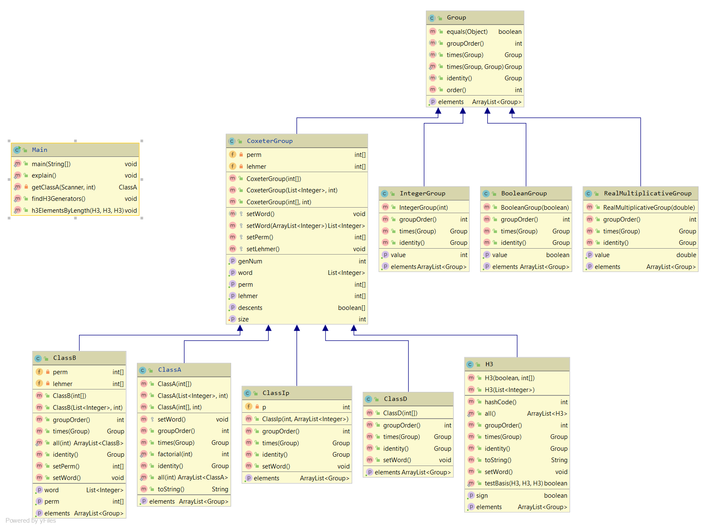

# Coxeter Groups
A collection of code to work with Coxeter groups. It allows the contruction of Class A_n, B_n, D_n, I_2p, and H_3 Coxeter groups. It also allows them to be manipulated, their various representations to be viewed, and information such as their descent sets or their generators sets to be acquired. In the case of H_3, that is information that I was unable to find in December of 2019.

This code was built by me. Large thanks is owed to Erik Insko for teaching me everything I know about Coxeter groups and Scott Vanselow for teaching me Java and providing the impetus to build this project as a class assignment.

## Documentation

https://tomshlomi.github.io/CoxeterGroups/

## Diagrams

## Getting Started

Pulling this project from GitHub should allow the program to be run and further edits to be made. Note that there is a very minimal user interace, so exploration of Coxeter groups will require code to be added to Main.

A few warnings for any additions to this project: As testing whether something is a group is a hard problem, there are no guarrantees that a class extending Group will be a group, though all such classes written by me are. As the size of Coxeter groups has a rate of growth somewhere between n! and n!2^n, be careful when working with large Coxeter groups as some methods could run for an extremely long time.

## Built With

This was built using IntelliJ IDEA to develop Java code.

## Contributing

This code is entirely self-contained; it cannot read external inputs. Further development could include adding a user interface, adding protections against methods that now take too long to run, and implementing other functionality regarding conjectures on Coxeter groups.

## Author
Tom Shlomi

## License

MIT License

Copyright (c) 2019 TomShlomi

Permission is hereby granted, free of charge, to any person obtaining a copy
of this software and associated documentation files (the "Software"), to deal
in the Software without restriction, including without limitation the rights
to use, copy, modify, merge, publish, distribute, sublicense, and/or sell
copies of the Software, and to permit persons to whom the Software is
furnished to do so, subject to the following conditions:

The above copyright notice and this permission notice shall be included in all
copies or substantial portions of the Software.

THE SOFTWARE IS PROVIDED "AS IS", WITHOUT WARRANTY OF ANY KIND, EXPRESS OR
IMPLIED, INCLUDING BUT NOT LIMITED TO THE WARRANTIES OF MERCHANTABILITY,
FITNESS FOR A PARTICULAR PURPOSE AND NONINFRINGEMENT. IN NO EVENT SHALL THE
AUTHORS OR COPYRIGHT HOLDERS BE LIABLE FOR ANY CLAIM, DAMAGES OR OTHER
LIABILITY, WHETHER IN AN ACTION OF CONTRACT, TORT OR OTHERWISE, ARISING FROM,
OUT OF OR IN CONNECTION WITH THE SOFTWARE OR THE USE OR OTHER DEALINGS IN THE
SOFTWARE.

## Acknowledgments

Large thanks is owed to Erik Insko for teaching me everything I know about Coxeter groups and Scott Vanselow for teaching me Java and providing the impetus to build this project as a class assignment.

## History

## Key Programming Concepts Utilized

This assignment required the utilization of many concepts and techniques object-oriented programming, including: inheritance, which allowed me to use the methods defined in the Group and CoxeterGroup classes in ClassA, ClassB, H3, ... and error handling, since the restrictions on acceptable inputs are not represented well by existing Java datatypes or classes.
